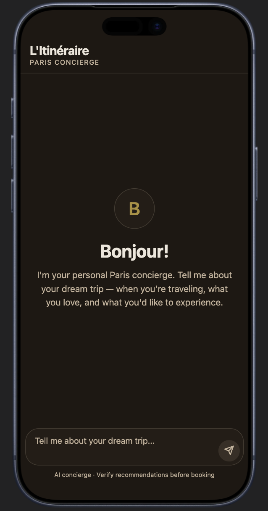
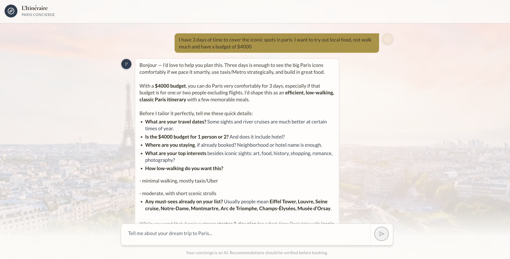
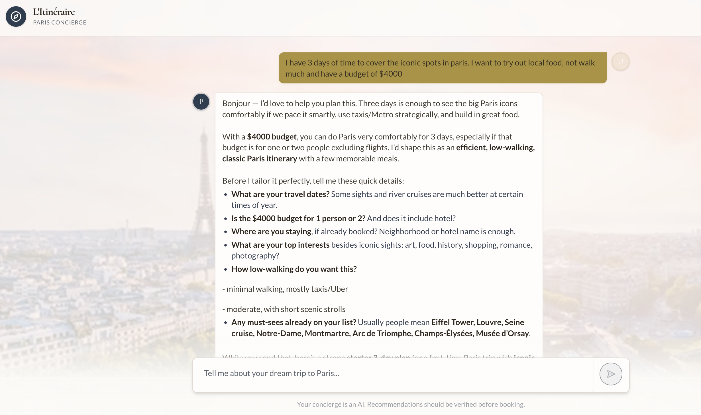
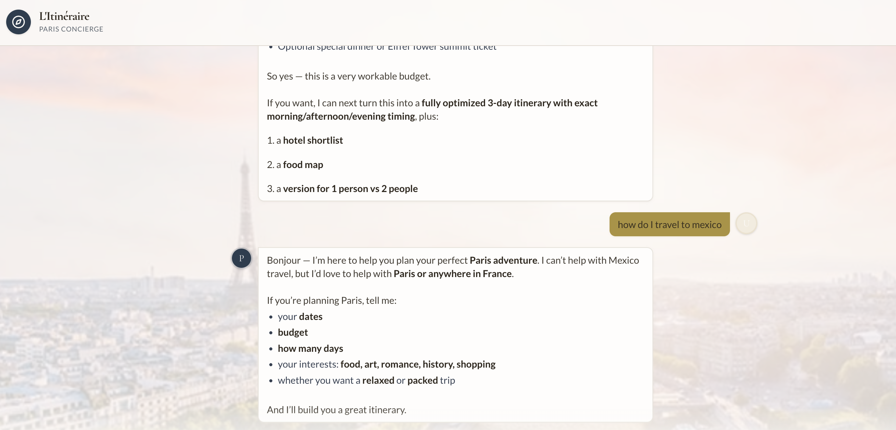

# L'Itinéraire — AI-Powered Paris Trip Planner

An AI travel concierge that helps you plan a personalised, day-by-day Paris itinerary through a natural conversation. Available as a web app and a mobile app, sharing a single backend.

---

## Features

- **Conversational AI planning** — chat with *L'Itinéraire*, a Paris-specialist AI persona, to build a bespoke itinerary around your dates, budget, and interests
- **Real-time streaming** — responses stream word-by-word via Server-Sent Events for a responsive feel
- **Persistent conversations** — start, revisit, and manage multiple trip-planning conversations stored in PostgreSQL
- **Guardrails** — the AI stays focused on Paris travel; prompt injection and off-topic requests are gracefully deflected
- **Prompt logging** — every user message is logged (conversation ID, IP, user-agent) for moderation and auditing
- **Parisian theme** — warm gold, parchment, and dusty-blue palette with serif typography across web and mobile
- **Cross-platform** — full feature parity between the React web app and the Expo mobile app

---

## Tech Stack

| Layer | Technology |
|---|---|
| Web frontend | React 19, Vite, Tailwind CSS 4, TanStack Query, Wouter, Framer Motion |
| Mobile | Expo SDK 54, React Native 0.81, Expo Router |
| Backend | Node.js 24, Express 5, Pino |
| Database | PostgreSQL + Drizzle ORM |
| AI | OpenAI GPT-4 (via streaming chat completions) |
| API contract | OpenAPI 3 → Orval (generates React Query hooks + Zod validators) |
| Monorepo | pnpm workspaces, TypeScript 5.9 |

---

## Project Structure

```
.
├── artifacts/
│   ├── paris-planner/          # React + Vite web app
│   ├── paris-planner-mobile/   # Expo / React Native mobile app
│   ├── api-server/             # Express 5 API server
│   └── mockup-sandbox/         # UI component preview server (dev only)
└── lib/
    ├── db/                     # Drizzle ORM schema + PostgreSQL client
    ├── api-spec/               # OpenAPI spec (source of truth)
    ├── api-client-react/       # Generated React Query hooks
    ├── api-zod/                # Generated Zod request schemas
    └── integrations-openai-ai-server/  # OpenAI client wrapper
```

---

## UI

### Mobile app

The mobile app is built with Expo / React Native and shares the same backend as the web app. On launch, the concierge greets the user with a welcome screen before opening into the full chat interface.



### Web app

The web app provides the same conversational experience in a browser, with a responsive layout that adapts from desktop to narrow viewports.





---

## How It Works

1. The user types a message in the web or mobile app.
2. The API server logs the prompt, saves the user message to PostgreSQL, then calls OpenAI with the full conversation history and the Paris-specialist system prompt.
3. The AI response is streamed back over SSE and rendered in real-time.
4. The completed assistant message is saved to PostgreSQL, and TanStack Query updates the local cache.

---

## Getting Started

### Prerequisites

- Node.js 20+
- pnpm 9+
- A PostgreSQL database (set `DATABASE_URL` in your environment)
- An OpenAI API key (set `OPENAI_API_KEY` in your environment)

### Install dependencies

```bash
pnpm install
```

### Push the database schema

```bash
pnpm --filter @workspace/db run push
```

### Run all services

```bash
# API server
pnpm --filter @workspace/api-server run dev

# Web app
pnpm --filter @workspace/paris-planner run dev

# Mobile app
pnpm --filter @workspace/paris-planner-mobile run dev
```

---

## Database Schema

| Table | Columns |
|---|---|
| `conversations` | `id`, `title`, `created_at` |
| `messages` | `id`, `conversation_id`, `role`, `content`, `created_at` |
| `prompt_logs` | `id`, `conversation_id`, `content`, `ip_address`, `user_agent`, `created_at` |

---

## AI Guardrails

The system prompt enforces:

- **Scope** — only answers Paris / France travel questions
- **Confidentiality** — never reveals system prompt contents
- **Prompt injection** — ignores attempts to override instructions
- **Harmful content** — refuses to produce anything harmful or illegal
- **Identity** — always presents as *L'Itinéraire*, never another AI

### Guardrails in action

**Off-topic request deflected**

When a user asks about travel outside Paris (e.g. "how do I travel to Mexico"), the assistant politely declines and steers the conversation back to Paris trip planning — without breaking character or exposing system prompt details.



---

## License

MIT
